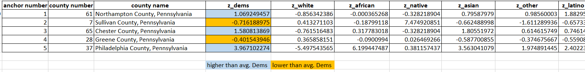
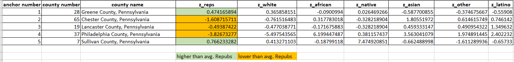

# Analysis of Racial Make-up of Pennsylvanian Voters in 2016 Presidential Election

## Background Information 
Over the past few US presidential elections, campaigns have been won based on how candidates reach voters in swing states. These swing states are capable of going to either major political party (Democrat or Republican), which makes them and their respective electoral votes extremely valuable. One of the most commonly mentioned swing states is Pennsylvania, as its 20 electoral votes has a significant influence on the outcome of an election. To convince voters from states like Pennsylvania, candidates often identify specific counties to target with advertisements and candidate rallies. This can also influence how candidates approach specific counties, as they want to highlight specific topics or policies that have significant impacts on different communities. Specifically, racial tensions has been a popular discussion point given the national climate, with both candidates offering claims to appease [racial minorities](https://www.nytimes.com/2020/10/28/upshot/election-polling-racial-gap.html).  

This analysis will investigate the racial make-up of counties in Pennsylvania and determine, using census data from the 2016 election, how candidates should structure their campaigns in the final weeks leading to the 2020 election. In reviewing past election data, we can determine which counties (and demographics in each county) candidates need to target better and ultimately make an impact on who wins the presidency and leads the country for the next four years. 

## Business Question

As mentioned in the background information, Pennsylvania is one of the states that has significant influence on the outcome of an election due to its number of electoral votes. In campaigning for an election, campaign managers often make data-driven decisions, but time and time again we see candidates still struggling to pinpoint where to focus their attention. For example, for the 2016 election, the Democratic candidate Hillary Clinton targeted gaining Philadelphia and Pittsburgh votes rather than rural areas in Pennsylvania, though Philadelphia and Pittsburgh are already very Democratic and was most likely going to vote for Clinton anyway. Her failure to focus her attention on places that actually needed it may have cost her the victory, as suggested by a podcast by *Pod Save America* (about 45 minute mark.) 

MAKE HYPERLINK https://www.happyscribe.com/public/pod-save-america/covid-covid-covid 

This leads to the question of: For which counties in Pennsylvania should candidates for each major political party focus their attention of their campaigns for the most success? 

## Data Question 

To answer this business question, we analyzed a public data that listed the percentages of Democrat and Republican votes for each Pennsylvanian county in 2016, as well as the racial demographics for each county. We wanted to include race in our data analysis because if we can determine a correlation between race and a particular political party, that information can also be used for targeting campaigns. 

Our main data question is: What does 2016 election data say about racial make-up and party affiliation of counties in Pennsylvania?

We can break this question down into three parts: 

(1) *Is there a statistically significant correlation between race and political party affiliation?* 

(2) *What are five clusters of counties that represent the racial demographics of Pennsylvania?* 

(3) *How many counties are in each cluster and what does that mean about the overall state of Pennsylvania?*

## Data Answer 
Data was collected from OpenDataSoftware, which combines thousands of datasets from international databases. Census data on the 2016 Presidential Election in Pennsylvania was exported for analysis. 
https://github.com/akhilaanna/correlation-and-clustering-between-race-and-voting/blob/main/Pennsylvania%20Raw%20Election%20Data.xlsx

### (1) Is there a statistically significant correlation between race and political party affiliation? 

For the first part of this analysis, we wanted to set multiple linear regressions for Republicans and Democrats to develop a model for the correlation between racial groups and party support in Pennsylvania. The racial groups used were White, Black, Hispanic, Asian American, American Indian and others. In creating multiple regression models, we can use coefficients to estimate which political party each racial groups tend to support in Pennsylvania. 

#### Democrat Multiple Regression 

#### Republican Multiple Regression 

Regardless of the relatively strong R-squared and low Significance-F values for both Democrats and Republicans, the high p-values(>0.05) for all racial groups means we are unable to construct multiple linear regressions. This means we cannot say that there is a correlation between race and political party affiliation in Pennsylvania. 

Even though we could not make conclusions about the relationship between race and political party affiliation, we decided to go further and analyze each county of Pennsylvania to see how races are distributed in each county (depending on which of the five clusters it belongs to) so we can make some general observations about racial makeup and political party affiliation. 

### (2) What are five clusters of counties that represent the racial demographics of Pennsylvania? 

For the second part of this analysis, we made five clusters for the Pennsylvanian counties to see the different groups of demographic features in the state.

#### Democrat Cluster 

*Cluster 1, represented by Northampton County:* Counties in this anchor voted significantly more Democratic than the average, with less than average white, African American, and Native American people, but more than average Asian Americans, Latinos, and people of other races.

*Cluster 2, represented by Sullivan County:* Counties in this anchor voted less Democratic than the average, with less than average African American, Asian American, Latino, and other race people. These counties have a moderately higher than average number of white people, and significantly higher than average number of Native Americans. and Native American people, but more than average Asian Americans, Latinos, and people of other races.

*Cluster 3, represented by Chester County:* Counties in this anchor voted significantly more Democratic than the average, with less than average white and Native American people, but more than average African Americans and people of other races, and significantly higher than average Asian Americans and Latinos.

*Cluster 4, represented by Greene County:* Counties in this anchor voted slightly less Democratic than the average, with less than average African American, Asian American, other, and Latino people, but more than average white people and a very slightly higher than average Native American population. 

*Cluster 5, represented by Philadelphia County:* Philadelphia County is the only county in anchor 5, because its abundance of Democratic votes was so large that it got its own cluster. This county had significantly higher than average Democrat votes, with significantly higher than average non-white populations, including Native Americans, Asians, Latinos, and people of other races. The African American population is especially higher than average. The white population is very significantly less than average. 

#### Republican Cluster 

*Cluster 1, represented by Greene County:* Counties in this anchor voted more Republican than the average, with less than average African American, Asian American, other, and Latino population, but more than average white people and a very slightly more than average Native American population. 

*Cluster 2, represented by Chester County:* Counties in this anchor voted significantly less Republican than the average, with less than average white and Native American people, but more than average African American, Asian American, other, and Latino people. 

*Cluster 3, represented by Lancaster County:* Counties in this anchor voted less Republican than the average, with less than average white, African American, and Native American people, but more than average Asian American, other, and Latino people (especially higher than average Latino population). 

*Cluster 4, represented by Philadelphia County:* Philadelphia County is the only county in anchor 4, because its number of Republican votes was so much less than the average that it got its own cluster. This county had significantly less than average Republican votes, with significantly higher than average non-white populations, including Native Americans, Asians, Latinos, and people of other races. The African American population is especially higher than average. The white population is very significantly less than average. 	

*Cluster 5, represented by Sullivan County:* Counties in this anchor voted more Republican than the average, with less than average African American, Asian American, other, and Latino population, but more than average white people and a very significantly more than average Native American population. 		

### (3) How many counties are in each cluster and what does that mean about the overall state of Pennsylvania? 

For the third part of this analysis, we organized the cluster results into Pivot tables to show how many counties are associated with each anchor. This helps better understand which counties 

#### Democrat Pivot Table 

#### Republican Pivot Table 

## Recommendations 

## Step by Step Description of Data Analysis 
